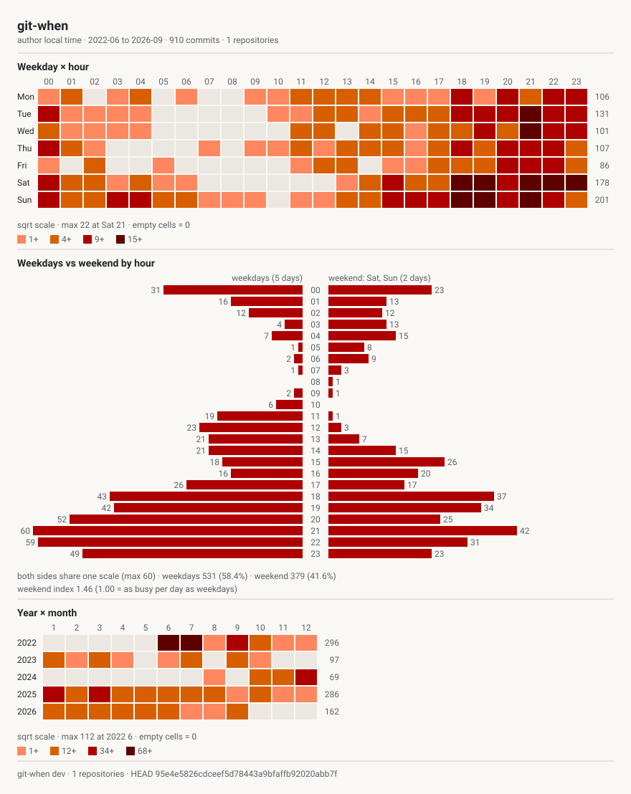

<h1 align="center">
  
  git-when
</h1>

<p align="center">
  See when commits happen across your Git repositories.
</p>

<div align="center">

[![Release][releases-shield]][releases-url]
[![AI-generated code][ai-shield]][ai-url]

</div>

> [!IMPORTANT]
> This project is developed primarily by AI coding agents. Most of the code is AI-generated and is
> generally not manually reviewed or inspected in detail. Changes are mainly evaluated through
> automated tests and observed behavior.
>
> Do not assume that the code has received conventional human code review.


`git-when` reads the history of one or more Git repositories and shows the hours and weekdays
when commits happen. It draws a terminal heatmap, a self-contained HTML report, a static SVG,
or CSV.

## Features

- Finds every repository under the directories you give it.
- Counts commits in the local time recorded in each commit.
- Shows weekday by hour heatmaps, hourly bars, monthly grids, weekend activity, and time zone
  changes.
- Writes an HTML report that works offline as one file. You can switch repositories, authors,
  years, views, language, and theme in the browser.
- Caches `git log` output, so later runs are fast.

## Install

Download an archive for Linux, macOS, or Windows from
[GitHub Releases](https://github.com/tsutsu3/git-when/releases).

Or install it with Go 1.21 or newer. If your Go is older than the version in `go.mod`
(Go 1.27.1), Go downloads that version automatically:

```sh
go install github.com/tsutsu3/git-when/cmd/git-when@latest
```

## Usage

Analyze the current repository in the terminal:

```sh
git-when .
```

Search several directory trees and create an HTML report:

```sh
git-when ~/work ~/src --format html --out git-when.html
```

Create one SVG with several views:

```sh
git-when . --format svg --view heatmap,week,month --out git-when.svg
```

Export every bucket as CSV:

```sh
git-when . --format csv --out git-when.csv
```

### Common options

```text
-f, --format FORMAT      term, csv, svg, or html
-o, --out FILE           output file
-v, --view NAMES         views to draw, for example heatmap,week
--author REGEXP          include matching authors only
--exclude-author REGEXP  exclude matching authors
--weekend DAYS           weekend days, for example fri,sat
--week-start DAY         first displayed weekday
--scale SCALE            sqrt, linear, or log
--theme THEME            auto, light, or dark
--min-total N            hide grid rows, or HTML authors, with fewer commits
--max-depth N            repository search depth, 0 means no limit
--follow-symlinks        also search symbolic links to directories
--no-cache               read Git history without the local cache
--version                print the version and exit
```

Run `git-when --help` for every option.

### Publishing an HTML report

The HTML report never contains local paths. The home directory in the recorded command line is
written as `~`. These options help when you share or publish the report:

```text
--default-author REGEXP  author selected when the page opens
--no-email               leave out author emails
--no-github-link         hide the link to the GitHub repository
--min-total N            hide authors with fewer commits from the author list
```

For example:

```sh
mkdir -p public
git-when ~/src --format html --default-author tsutsu3 --no-email --out public/index.html
```

The recorded command line stays in the report, so do not write an email in a flag such as
`--author` if you use `--no-email`.

## Output examples

### Interactive HTML


### Static SVG

SVG output is self-contained and fits README files, documents, and slides.



## Documentation

- [Examples](docs/examples.md) shows the output of each view and option.
- [Specification](docs/spec.md) describes the behavior that users and scripts rely on.

## Development

Requirements:

- Go 1.27.1 or newer
- Node.js v24 or newer and pnpm 12 or newer, only to edit the HTML frontend

Build and test the command:

```sh
go build -o git-when ./cmd/git-when
go test ./...
```

The generated HTML template is committed, so a Go build does not need Node.js.
To change the frontend, install the dependencies and rebuild the template:

```sh
pnpm install --frozen-lockfile
pnpm dev:template    # Astro dev server with sample data
pnpm test:template   # Vitest unit tests
pnpm lint:template   # ESLint, declaration order only
pnpm format          # Prettier
pnpm build:template  # writes internal/render/template.html
go test ./...
```

`go generate ./internal/render` runs the same build.

See [architecture.md](docs/architecture.md) for how the code is organized and
[AGENTS.md](AGENTS.md) for the rules and checks.

### Demo site

The demo is a normal report that a maintainer builds by hand and commits as `public/index.html`.
It is built locally because the report is more useful when it covers many repositories, and a
release runner only has this one. The `build:demo` script in `package.json` holds the flags:

```sh
pnpm build:demo
```

Review the result, commit it, then deploy it when you want to update the demo:

```sh
pnpm preview              # serve the demo from a local Worker
pnpm deploy:prd           # deploy to Cloudflare
```

Deploying needs a Cloudflare login, either `pnpm wrangler login` or the `CLOUDFLARE_ACCOUNT_ID`
and `CLOUDFLARE_API_TOKEN` environment variables. Copy `.env.example` to `.env.prd` to keep the
production values, because `--env prd` reads that file. No workflow deploys the demo.

## Release

Update the `version` constant in `cmd/git-when/version.go`. Create and push the matching release
branch:

```sh
version="$(go run ./cmd/git-when --version)"
git switch -c "release-v${version}"
git push -u origin "release-v${version}"
```

The `Release preparation` workflow generates `CHANGELOG.md` with git-cliff and commits it to the
release branch. It verifies the Go and frontend code and tests a release build. Open a pull request
from the release branch to `main` after these checks pass.

Merging that pull request tags the merged commit, builds archives for Linux, macOS, and Windows on
amd64 and arm64, and creates a draft GitHub Release with SHA-256 checksums. The release does not
touch the demo site. See [Demo site](#demo-site) for that.

To publish the final release, open the `Publish release` workflow in GitHub Actions and choose
`Run workflow`. It publishes the draft for the version embedded in Go. This is the only step that
publishes the draft.

[releases-shield]: https://img.shields.io/github/v/release/tsutsu3/git-when?style=for-the-badge&logo=github&display_name=release
[releases-url]: https://github.com/tsutsu3/git-when/releases
[ai-shield]: https://img.shields.io/badge/AI--generated-code-6f42c1?style=for-the-badge&logo=data:image/svg%2bxml;base64,PHN2ZyB4bWxucz0iaHR0cDovL3d3dy53My5vcmcvMjAwMC9zdmciIHZpZXdCb3g9IjAgMCAyNCAyNCI+PHBhdGggZmlsbD0id2hpdGUiIGQ9Ik0xMCAybDEuOCA1LjdMMTcuNSA5LjVsLTUuNyAxLjhMMTAgMTdsLTEuOC01LjdMMi41IDkuNWw1LjctMS44ek0xOC41IDEzbC45IDIuNiAyLjYuOS0yLjYuOS0uOSAyLjYtLjktMi42LTIuNi0uOSAyLjYtLjl6Ii8+PC9zdmc+
[ai-url]: AGENTS.md
