# Examples

This page shows what each option does, using real output from a small set of
example repositories. For the full list of options and defaults, see
[spec.md](spec.md).

- **Terminal images** show commands run in a terminal with
  `--color always --theme light`. Grids use a single orange color ramp.
- **SVG images** are the output of the same view with `-f svg`. They follow the
  viewer's light or dark color scheme.
- **Plain text** is the default output without colors. It appears in a collapsible
  section below each image. Some Markdown viewers draw the block characters with
  gaps or misaligned columns, which is why the images come first.

## Example repositories

The examples run in a directory that contains four repositories under `src/`.
The commits have fixed dates ranging from 2024-01 to 2025-12.

```text
src/
  work/api-server   Alice and Dave, office hours, plus dependabot[bot]
  work/frontend     Bob and Dave, office hours, plus dependabot[bot]
  oss/git-when      Carol, evenings and weekends
  notes/til         Carol and Bob, a few notes a week
```

The commits from Alice, Bob, and Carol record `+09:00`. Dave's commits record `+05:30`.
Carol moved to San Francisco in 2025-04, so her later commits record `-07:00` and `-08:00`.

## Terminal views

### Default: weekday by hour

```sh
git-when src
```

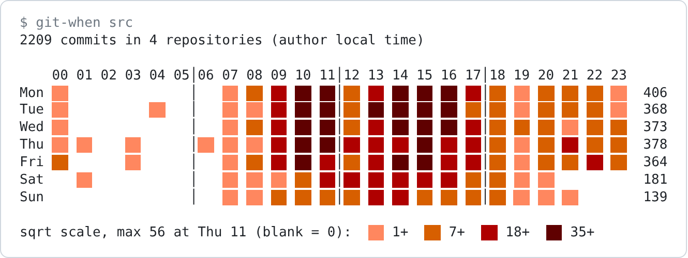

SVG: `git-when src -f svg -o heatmap.svg`

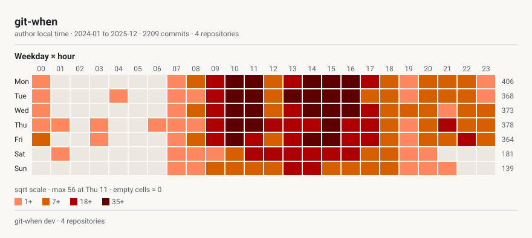

Bot commits are excluded by default, so the Dependabot commits are not counted.

<details>
<summary>Plain text output</summary>

```text
$ git-when src
2209 commits in 4 repositories (author local time)

    00 01 02 03 04 05│06 07 08 09 10 11│12 13 14 15 16 17│18 19 20 21 22 23
Mon ░░               │   ░░ ▒▒ ▓▓ ██ ██│▒▒ ▓▓ ██ ██ ██ ▓▓│▒▒ ░░ ▒▒ ▒▒ ▒▒ ░░  406
Tue ░░          ░░   │   ░░ ░░ ▓▓ ██ ██│▒▒ ██ ██ ██ ██ ▒▒│▒▒ ░░ ▒▒ ▒▒ ▒▒ ░░  368
Wed ░░               │   ░░ ▒▒ ▓▓ ██ ██│▒▒ ▓▓ ██ ██ ██ ▓▓│▒▒ ▒▒ ▒▒ ░░ ▒▒ ▒▒  373
Thu ░░ ░░    ░░      │░░ ░░ ░░ ▓▓ ██ ██│▓▓ ▓▓ ▓▓ ██ ▓▓ ▓▓│▒▒ ░░ ▒▒ ▓▓ ▒▒ ▒▒  378
Fri ▒▒       ░░      │   ░░ ▒▒ ▓▓ ██ ▓▓│▒▒ ▓▓ ██ ██ ▓▓ ▓▓│▒▒ ░░ ▒▒ ▒▒ ▓▓ ▒▒  364
Sat    ░░            │   ░░ ░░ ░░ ▒▒ ▓▓│▓▓ ▓▓ ▓▓ ▓▓ ▓▓ ▒▒│▒▒ ░░ ░░           181
Sun                  │   ░░ ░░ ▒▒ ▒▒ ▒▒│▒▒ ▓▓ ▓▓ ▒▒ ▒▒ ▒▒│▒▒ ░░ ░░ ░░        139

sqrt scale, max 56 at Thu 11 (blank = 0):  ░░ 1+  ▒▒ 7+  ▓▓ 18+  ██ 35+
```

</details>

### `--view hour`

```sh
git-when src --view hour
```

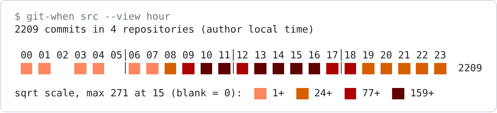

SVG: `git-when src -f svg -v hour -o hour.svg`

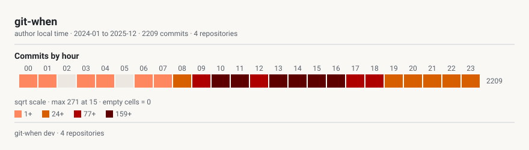

<details>
<summary>Plain text output</summary>

```text
$ git-when src --view hour
2209 commits in 4 repositories (author local time)

 00 01 02 03 04 05│06 07 08 09 10 11│12 13 14 15 16 17│18 19 20 21 22 23
 ░░ ░░    ░░ ░░   │░░ ░░ ▒▒ ▓▓ ██ ██│▓▓ ██ ██ ██ ██ ▓▓│▓▓ ▒▒ ▒▒ ▒▒ ▒▒ ▒▒  2209

sqrt scale, max 271 at 15 (blank = 0):  ░░ 1+  ▒▒ 24+  ▓▓ 77+  ██ 159+
```

</details>

### `--view month`

```sh
git-when src --view month
```

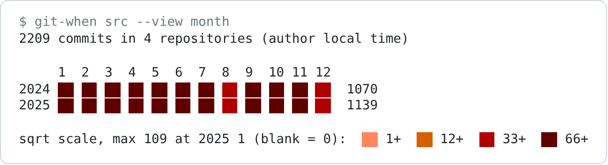

SVG: `git-when src -f svg -v month -o month.svg`

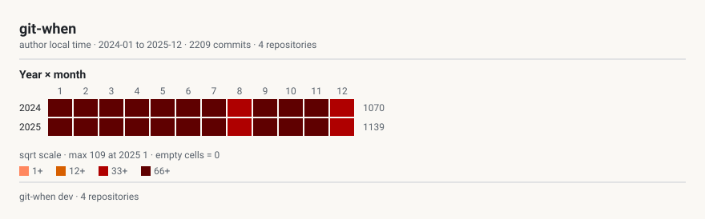

<details>
<summary>Plain text output</summary>

```text
$ git-when src --view month
2209 commits in 4 repositories (author local time)

     1  2  3  4  5  6  7  8  9  10 11 12
2024 ██ ██ ██ ██ ██ ██ ██ ▓▓ ██ ██ ██ ▓▓  1070
2025 ██ ██ ██ ██ ██ ██ ██ ▓▓ ██ ██ ██ ▓▓  1139

sqrt scale, max 109 at 2025 1 (blank = 0):  ░░ 1+  ▒▒ 12+  ▓▓ 33+  ██ 66+
```

</details>

### `--view week`

Weekdays and the weekend share one scale, making lower weekend activity easy to see.

```sh
git-when src --view week
```

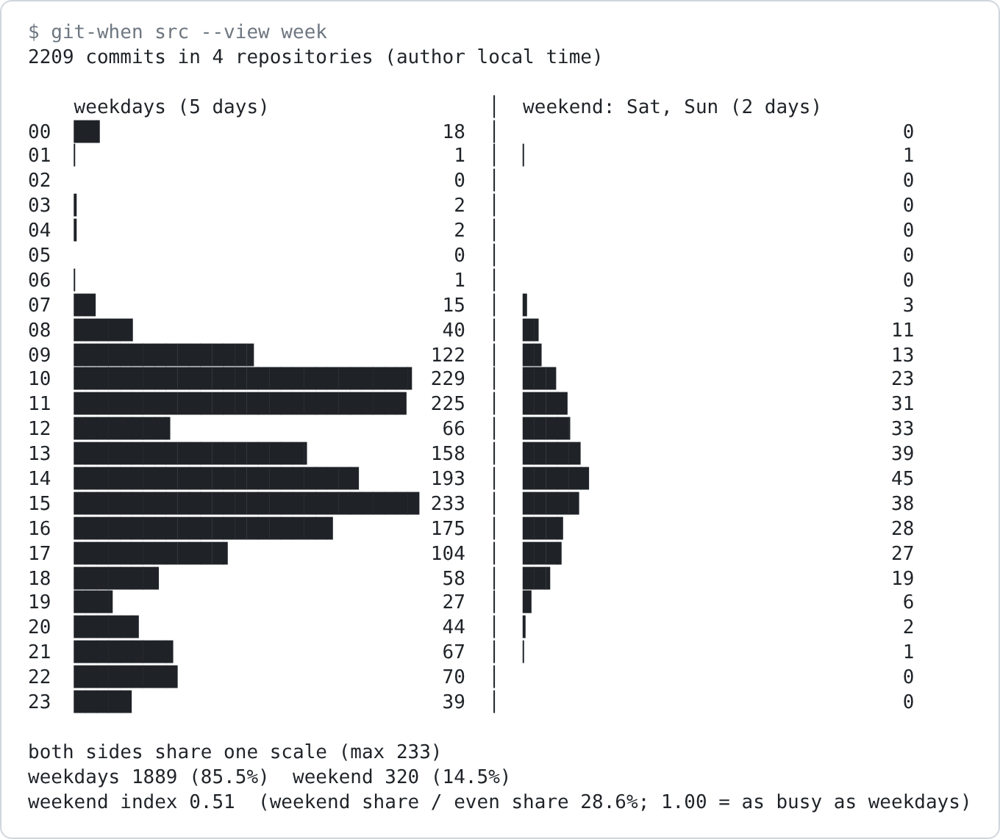

SVG: `git-when src -f svg -v week -o week.svg`

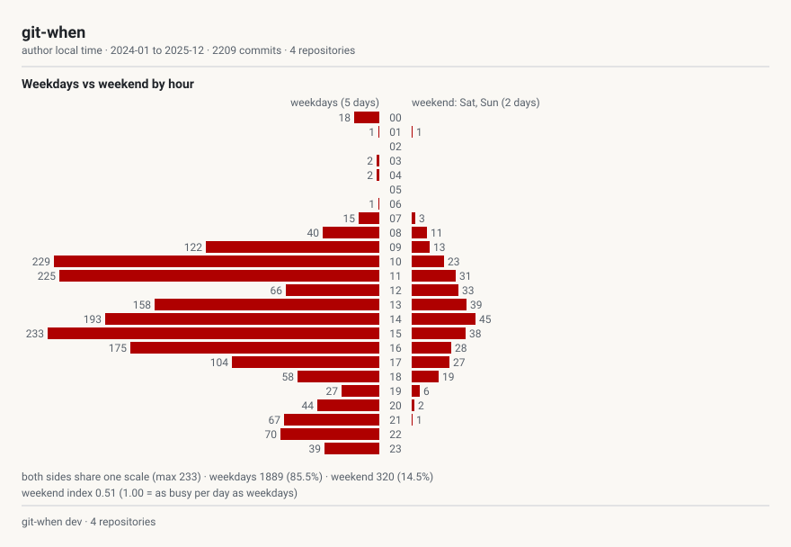

<details>
<summary>Plain text output</summary>

```text
$ git-when src --view week
2209 commits in 4 repositories (author local time)

    weekdays (5 days)                   │  weekend: Sat, Sun (2 days)
00  ██▎                             18  │                                   0
01  ▏                                1  │  ▏                                1
02                                   0  │                                   0
03  ▎                                2  │                                   0
04  ▎                                2  │                                   0
05                                   0  │                                   0
06  ▏                                1  │                                   0
07  █▉                              15  │  ▍                                3
08  █████▏                          40  │  █▍                              11
09  ███████████████▋               122  │  █▋                              13
10  █████████████████████████████▍ 229  │  ██▉                             23
11  ████████████████████████████▉  225  │  ███▉                            31
12  ████████▍                       66  │  ████▏                           33
13  ████████████████████▎          158  │  █████                           39
14  ████████████████████████▊      193  │  █████▊                          45
15  ██████████████████████████████ 233  │  ████▉                           38
16  ██████████████████████▌        175  │  ███▌                            28
17  █████████████▍                 104  │  ███▍                            27
18  ███████▍                        58  │  ██▍                             19
19  ███▍                            27  │  ▊                                6
20  █████▋                          44  │  ▎                                2
21  ████████▋                       67  │  ▏                                1
22  █████████                       70  │                                   0
23  █████                           39  │                                   0

both sides share one scale (max 233)
weekdays 1889 (85.5%)  weekend 320 (14.5%)
weekend index 0.51  (weekend share / even share 28.6%; 1.00 = as busy as weekdays)
```

</details>

### `--view weekday`

This view is terminal only.

```sh
git-when src --view weekday
```

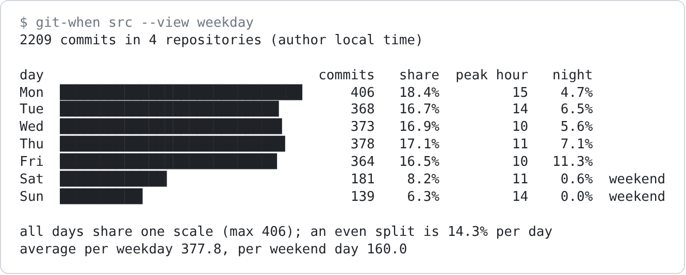

<details>
<summary>Plain text output</summary>

```text
$ git-when src --view weekday
2209 commits in 4 repositories (author local time)

day                                  commits   share  peak hour   night
Mon  ██████████████████████████████      406   18.4%         15    4.7%
Tue  ███████████████████████████▏        368   16.7%         14    6.5%
Wed  ███████████████████████████▌        373   16.9%         10    5.6%
Thu  ███████████████████████████▉        378   17.1%         11    7.1%
Fri  ██████████████████████████▉         364   16.5%         10   11.3%
Sat  █████████████▎                      181    8.2%         11    0.6%  weekend
Sun  ██████████▎                         139    6.3%         14    0.0%  weekend

all days share one scale (max 406); an even split is 14.3% per day
average per weekday 377.8, per weekend day 160.0
```

</details>

### `--view days`

This view is terminal only.

```sh
git-when src --view days
```

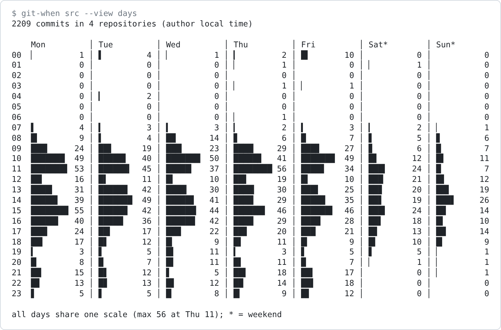

<details>
<summary>Plain text output</summary>

```text
$ git-when src --view days
2209 commits in 4 repositories (author local time)

    Mon         │ Tue         │ Wed         │ Thu         │ Fri         │ Sat*        │ Sun*
00  ▏         1 │ ▌         4 │ ▏         1 │ ▎         2 │ █▍       10 │           0 │           0
01            0 │           0 │           0 │ ▏         1 │           0 │ ▏         1 │           0
02            0 │           0 │           0 │           0 │           0 │           0 │           0
03            0 │           0 │           0 │ ▏         1 │ ▏         1 │           0 │           0
04            0 │ ▎         2 │           0 │           0 │           0 │           0 │           0
05            0 │           0 │           0 │           0 │           0 │           0 │           0
06            0 │           0 │           0 │ ▏         1 │           0 │           0 │           0
07  ▌         4 │ ▍         3 │ ▍         3 │ ▎         2 │ ▍         3 │ ▎         2 │ ▏         1
08  █▎        9 │ ▌         4 │ ██       14 │ ▊         6 │ █         7 │ ▋         5 │ ▊         6
09  ███▍     24 │ ██▋      19 │ ███▎     23 │ ████▏    29 │ ███▊     27 │ ▊         6 │ █         7
10  ███████  49 │ █████▋   40 │ ███████▏ 50 │ █████▊   41 │ ███████  49 │ █▋       12 │ █▌       11
11  ███████▌ 53 │ ██████▍  45 │ █████▎   37 │ ████████ 56 │ ████▊    34 │ ███▍     24 │ █         7
12  ██▎      16 │ █▌       11 │ █▍       10 │ ██▋      19 │ █▍       10 │ ███      21 │ █▋       12
13  ████▍    31 │ ██████   42 │ ████▎    30 │ ████▎    30 │ ███▌     25 │ ██▊      20 │ ██▋      19
14  █████▌   39 │ ███████  49 │ █████▊   41 │ ████▏    29 │ █████    35 │ ██▋      19 │ ███▋     26
15  ███████▊ 55 │ ██████   42 │ ██████▎  44 │ ██████▌  46 │ ██████▌  46 │ ███▍     24 │ ██       14
16  █████▋   40 │ █████▏   36 │ ██████   42 │ ████▏    29 │ ████     28 │ ██▌      18 │ █▍       10
17  ███▍     24 │ ██▍      17 │ ███▏     22 │ ██▊      20 │ ███      21 │ █▊       13 │ ██       14
18  ██▍      17 │ █▋       12 │ █▎        9 │ █▌       11 │ █▎        9 │ █▍       10 │ █▎        9
19  ▍         3 │ ▋         5 │ █▌       11 │ ▍         3 │ ▋         5 │ ▋         5 │ ▏         1
20  █▏        8 │ █         7 │ █▌       11 │ █▌       11 │ █         7 │ ▏         1 │ ▏         1
21  ██▏      15 │ █▋       12 │ ▋         5 │ ██▌      18 │ ██▍      17 │           0 │ ▏         1
22  █▊       13 │ █▊       13 │ █▋       12 │ ██       14 │ ██▌      18 │           0 │           0
23  ▋         5 │ ▋         5 │ █▏        8 │ █▎        9 │ █▋       12 │           0 │           0

all days share one scale (max 56 at Thu 11); * = weekend
```

</details>

### `--view summary`

This view is terminal only.

```text
$ git-when src --view summary
2209 commits in 4 repositories (author local time)

project          commits   share  authors  peak hour  peak day  night  weekend idx
---------------  -------  ------  -------  ---------  --------  -----  -----------
work/api-server      808   36.6%        2         11  Mon        0.2%         0.06
work/frontend        677   30.6%        2         15  Mon        0.1%         0.05
oss/git-when         545   24.7%        1         22  Sat       23.9%         1.90
notes/til            179    8.1%        2         14  Mon        0.0%         0.02
---------------  -------  ------  -------  ---------  --------  -----  -----------
total               2209  100.0%        4         15  Mon        6.0%         0.51
```

### `--view tzshift`

This view is terminal only.

```text
$ git-when src --view tzshift
2209 commits in 4 repositories (author local time)

year  -08:00  -07:00  +05:30  +09:00  total  most common
2024                     207     863   1070  +09:00  81%
2025      45     196     250     648   1139  +09:00  57%

UTC offsets as recorded by the authors
```

### Several views

`--view` takes a comma-separated list. In the terminal, each view gets a
`== title ==` heading. In SVG, the views are stacked in one sheet.

```sh
git-when src --view heatmap,week
```

SVG: `git-when src -f svg -v heatmap,week -o heatmap-week.svg`

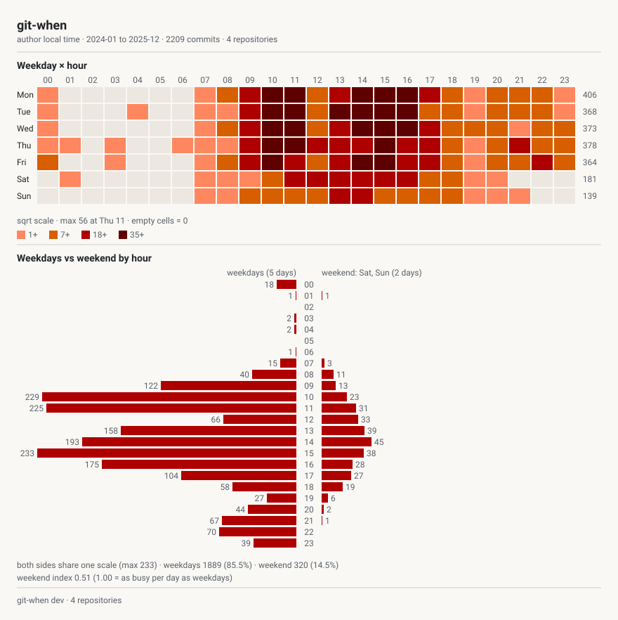

<details>
<summary>Plain text output (shortened)</summary>

```text
$ git-when src --view heatmap,week
2209 commits in 4 repositories (author local time)

== Weekday × hour ==
    00 01 02 03 04 05│06 07 08 09 10 11│12 13 14 15 16 17│18 19 20 21 22 23
Mon ░░               │   ░░ ▒▒ ▓▓ ██ ██│▒▒ ▓▓ ██ ██ ██ ▓▓│▒▒ ░░ ▒▒ ▒▒ ▒▒ ░░  406
...

== Weekdays vs weekend by hour ==
    weekdays (5 days)                   │  weekend: Sat, Sun (2 days)
...
```

</details>

`--view all` draws every terminal view in the order shown on this page. With
`-f svg`, it draws `heatmap`, `hour`, `week`, and `month`.

## Custom grids with `--pivot`

`--pivot y/x` uses any two of `hour`, `wday`, `month`, `year`, `project`, and
`author` as axes.

### `--pivot year/hour`

```sh
git-when src --pivot year/hour
```

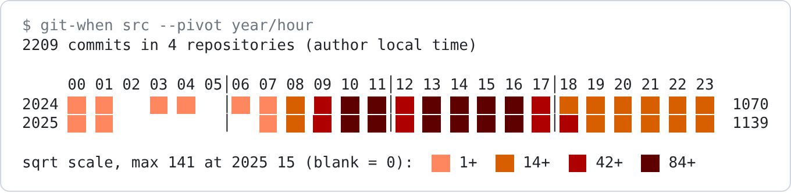

SVG: `git-when src -f svg -p year/hour -o pivot-year-hour.svg`

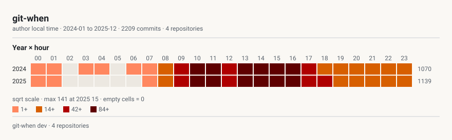

<details>
<summary>Plain text output</summary>

```text
$ git-when src --pivot year/hour
2209 commits in 4 repositories (author local time)

     00 01 02 03 04 05│06 07 08 09 10 11│12 13 14 15 16 17│18 19 20 21 22 23
2024 ░░ ░░    ░░ ░░   │░░ ░░ ▒▒ ▓▓ ██ ██│▓▓ ██ ██ ██ ██ ▓▓│▒▒ ▒▒ ▒▒ ▒▒ ▒▒ ▒▒  1070
2025 ░░ ░░            │   ░░ ▒▒ ▓▓ ██ ██│▓▓ ██ ██ ██ ██ ▓▓│▓▓ ▒▒ ▒▒ ▒▒ ▒▒ ▒▒  1139

sqrt scale, max 141 at 2025 15 (blank = 0):  ░░ 1+  ▒▒ 14+  ▓▓ 42+  ██ 84+
```

</details>

### `--pivot author/wday`

```sh
git-when src --pivot author/wday
```

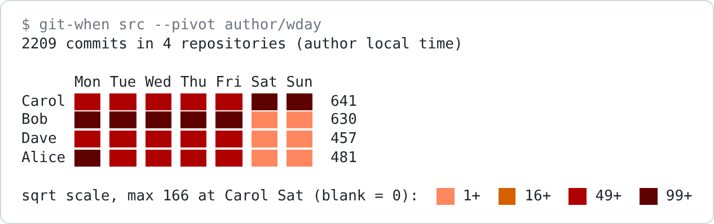

SVG: `git-when src -f svg -p author/wday -o pivot-author-wday.svg`

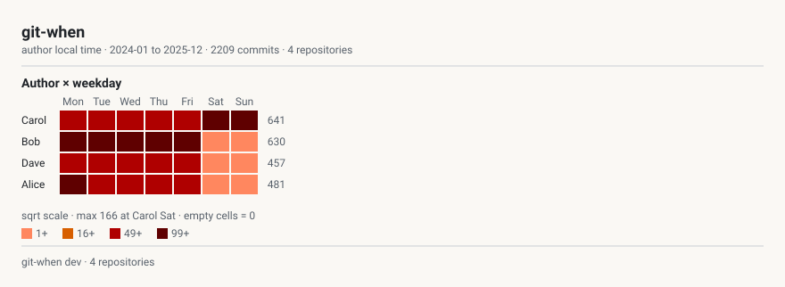

<details>
<summary>Plain text output</summary>

```text
$ git-when src --pivot author/wday
2209 commits in 4 repositories (author local time)

      Mon Tue Wed Thu Fri Sat Sun
Carol ▓▓▓ ▓▓▓ ▓▓▓ ▓▓▓ ▓▓▓ ███ ███  641
Bob   ███ ███ ███ ███ ███ ░░░ ░░░  630
Dave  ▓▓▓ ▓▓▓ ▓▓▓ ▓▓▓ ▓▓▓ ░░░ ░░░  457
Alice ███ ▓▓▓ ▓▓▓ ▓▓▓ ▓▓▓ ░░░ ░░░  481

sqrt scale, max 166 at Carol Sat (blank = 0):  ░░ 1+  ▒▒ 16+  ▓▓ 49+  ██ 99+
```

</details>

### `--min-total`

`--min-total` hides grid rows with fewer commits.

```sh
git-when src --pivot project/hour --min-total 200
```

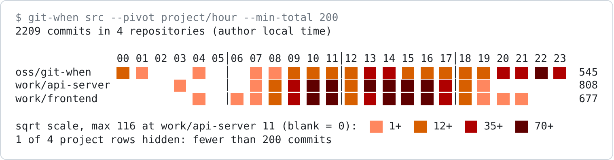

SVG: `git-when src -f svg -p project/hour --min-total 200 -o pivot-project-hour.svg`

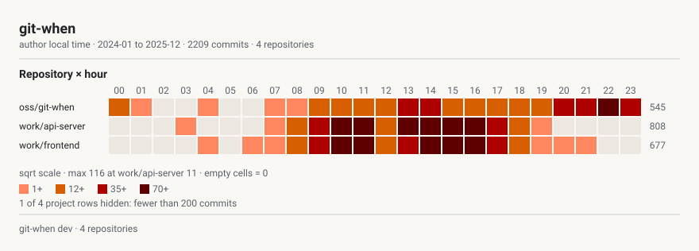

<details>
<summary>Plain text output</summary>

```text
$ git-when src --pivot project/hour --min-total 200
2209 commits in 4 repositories (author local time)

                00 01 02 03 04 05│06 07 08 09 10 11│12 13 14 15 16 17│18 19 20 21 22 23
oss/git-when    ▒▒ ░░       ░░   │   ░░ ░░ ▒▒ ▒▒ ▒▒│▒▒ ▓▓ ▓▓ ▒▒ ▒▒ ▒▒│▒▒ ▒▒ ▓▓ ▓▓ ██ ▓▓  545
work/api-server          ░░      │   ░░ ▒▒ ▓▓ ██ ██│▒▒ ██ ██ ██ ██ ▓▓│▒▒ ░░              808
work/frontend               ░░   │░░ ░░ ▒▒ ▓▓ ██ ██│▒▒ ▓▓ ██ ██ ██ ▓▓│▒▒ ░░ ░░ ░░        677

sqrt scale, max 116 at work/api-server 11 (blank = 0):  ░░ 1+  ▒▒ 12+  ▓▓ 35+  ██ 70+
1 of 4 project rows hidden: fewer than 200 commits
```

</details>

## Week options

`--week-start` changes the display order. `--weekend` changes which days count
as the weekend, which also changes the averages.

```sh
git-when src --view weekday --week-start sun --weekend fri,sat
```

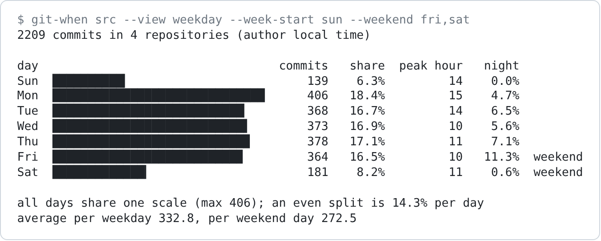

<details>
<summary>Plain text output</summary>

```text
$ git-when src --view weekday --week-start sun --weekend fri,sat
2209 commits in 4 repositories (author local time)

day                                  commits   share  peak hour   night
Sun  ██████████▎                         139    6.3%         14    0.0%
Mon  ██████████████████████████████      406   18.4%         15    4.7%
Tue  ███████████████████████████▏        368   16.7%         14    6.5%
Wed  ███████████████████████████▌        373   16.9%         10    5.6%
Thu  ███████████████████████████▉        378   17.1%         11    7.1%
Fri  ██████████████████████████▉         364   16.5%         10   11.3%  weekend
Sat  █████████████▎                      181    8.2%         11    0.6%  weekend

all days share one scale (max 406); an even split is 14.3% per day
average per weekday 332.8, per weekend day 272.5
```

</details>

## Shading scales

The default `sqrt` scale is shown above. `linear` makes only the busiest
cells dark. `log` makes low counts easier to see.

### `--scale linear`

```sh
git-when src --scale linear
```

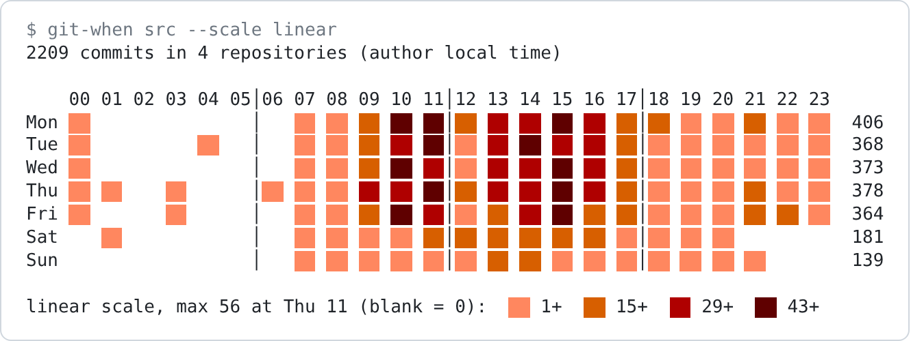

SVG: `git-when src -f svg --scale linear -o scale-linear.svg`

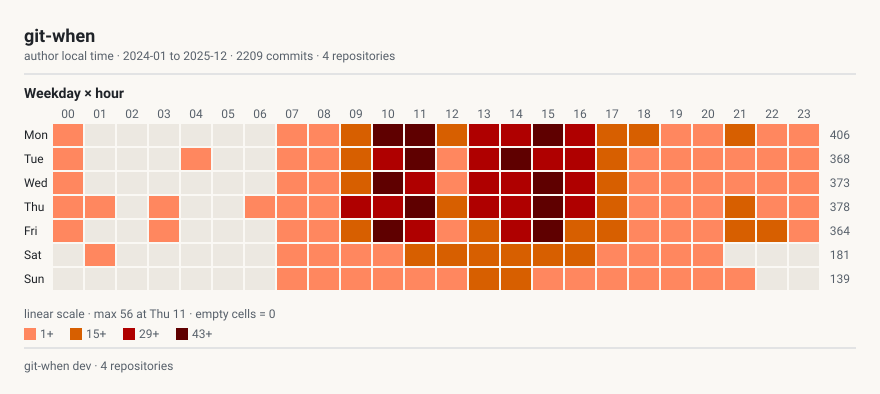

<details>
<summary>Plain text output</summary>

```text
$ git-when src --scale linear
2209 commits in 4 repositories (author local time)

    00 01 02 03 04 05│06 07 08 09 10 11│12 13 14 15 16 17│18 19 20 21 22 23
Mon ░░               │   ░░ ░░ ▒▒ ██ ██│▒▒ ▓▓ ▓▓ ██ ▓▓ ▒▒│▒▒ ░░ ░░ ▒▒ ░░ ░░  406
Tue ░░          ░░   │   ░░ ░░ ▒▒ ▓▓ ██│░░ ▓▓ ██ ▓▓ ▓▓ ▒▒│░░ ░░ ░░ ░░ ░░ ░░  368
Wed ░░               │   ░░ ░░ ▒▒ ██ ▓▓│░░ ▓▓ ▓▓ ██ ▓▓ ▒▒│░░ ░░ ░░ ░░ ░░ ░░  373
Thu ░░ ░░    ░░      │░░ ░░ ░░ ▓▓ ▓▓ ██│▒▒ ▓▓ ▓▓ ██ ▓▓ ▒▒│░░ ░░ ░░ ▒▒ ░░ ░░  378
Fri ░░       ░░      │   ░░ ░░ ▒▒ ██ ▓▓│░░ ▒▒ ▓▓ ██ ▒▒ ▒▒│░░ ░░ ░░ ▒▒ ▒▒ ░░  364
Sat    ░░            │   ░░ ░░ ░░ ░░ ▒▒│▒▒ ▒▒ ▒▒ ▒▒ ▒▒ ░░│░░ ░░ ░░           181
Sun                  │   ░░ ░░ ░░ ░░ ░░│░░ ▒▒ ▒▒ ░░ ░░ ░░│░░ ░░ ░░ ░░        139

linear scale, max 56 at Thu 11 (blank = 0):  ░░ 1+  ▒▒ 15+  ▓▓ 29+  ██ 43+
```

</details>

### `--scale log`

```sh
git-when src --scale log
```

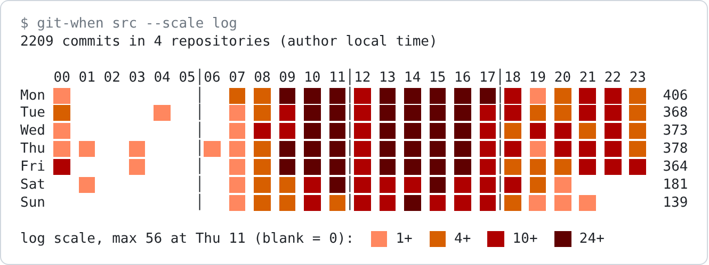

SVG: `git-when src -f svg --scale log -o scale-log.svg`

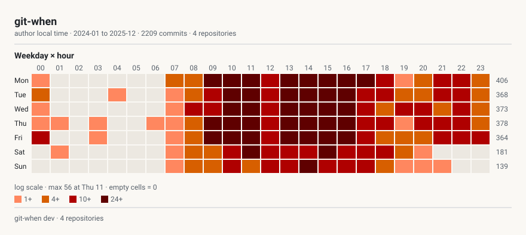

<details>
<summary>Plain text output</summary>

```text
$ git-when src --scale log
2209 commits in 4 repositories (author local time)

    00 01 02 03 04 05│06 07 08 09 10 11│12 13 14 15 16 17│18 19 20 21 22 23
Mon ░░               │   ▒▒ ▒▒ ██ ██ ██│▓▓ ██ ██ ██ ██ ██│▓▓ ░░ ▒▒ ▓▓ ▓▓ ▒▒  406
Tue ▒▒          ░░   │   ░░ ▒▒ ▓▓ ██ ██│▓▓ ██ ██ ██ ██ ▓▓│▓▓ ▒▒ ▒▒ ▓▓ ▓▓ ▒▒  368
Wed ░░               │   ░░ ▓▓ ▓▓ ██ ██│▓▓ ██ ██ ██ ██ ▓▓│▒▒ ▓▓ ▓▓ ▒▒ ▓▓ ▒▒  373
Thu ░░ ░░    ░░      │░░ ░░ ▒▒ ██ ██ ██│▓▓ ██ ██ ██ ██ ▓▓│▓▓ ░░ ▓▓ ▓▓ ▓▓ ▒▒  378
Fri ▓▓       ░░      │   ░░ ▒▒ ██ ██ ██│▓▓ ██ ██ ██ ██ ▓▓│▒▒ ▒▒ ▒▒ ▓▓ ▓▓ ▓▓  364
Sat    ░░            │   ░░ ▒▒ ▒▒ ▓▓ ██│▓▓ ▓▓ ▓▓ ██ ▓▓ ▓▓│▓▓ ▒▒ ░░           181
Sun                  │   ░░ ▒▒ ▒▒ ▓▓ ▒▒│▓▓ ▓▓ ██ ▓▓ ▓▓ ▓▓│▒▒ ░░ ░░ ░░        139

log scale, max 56 at Thu 11 (blank = 0):  ░░ 1+  ▒▒ 4+  ▓▓ 10+  ██ 24+
```

</details>

## Author filters

Filters match anywhere in `Name <email>`. Repositories remain in the table even
when no commit matches.

```text
$ git-when src --view summary --author carol
641 commits in 4 repositories (author local time)

project          commits   share  authors  peak hour  peak day  night  weekend idx
---------------  -------  ------  -------  ---------  --------  -----  -----------
oss/git-when         545   85.0%        1         22  Sat       23.9%         1.90
notes/til             96   15.0%        1         14  Thu        0.0%         0.04
work/api-server        0    0.0%        0          -  -             -            -
work/frontend          0    0.0%        0          -  -             -            -
---------------  -------  ------  -------  ---------  --------  -----  -----------
total                641  100.0%        1         22  Sat       20.3%         1.62
```

```text
$ git-when src --view summary --exclude-author dave
1752 commits in 4 repositories (author local time)

project          commits   share  authors  peak hour  peak day  night  weekend idx
---------------  -------  ------  -------  ---------  --------  -----  -----------
work/frontend        547   31.2%        1         15  Mon        0.2%         0.06
oss/git-when         545   31.1%        1         22  Sat       23.9%         1.90
work/api-server      481   27.5%        1         11  Mon        0.2%         0.06
notes/til            179   10.2%        2         14  Mon        0.0%         0.02
---------------  -------  ------  -------  ---------  --------  -----  -----------
total               1752  100.0%        3         15  Mon        7.5%         0.63
```

`--bots` includes bot commits. Here, the Dependabot author adds 156 commits, and its
early morning commits increase the night share.

```text
$ git-when src --view summary --bots
2365 commits in 4 repositories (author local time)

project          commits   share  authors  peak hour  peak day  night  weekend idx
---------------  -------  ------  -------  ---------  --------  -----  -----------
work/api-server      884   37.4%        3         11  Mon        8.7%         0.05
work/frontend        757   32.0%        3         15  Mon       10.6%         0.05
oss/git-when         545   23.0%        1         22  Sat       23.9%         1.90
notes/til            179    7.6%        2         14  Mon        0.0%         0.02
---------------  -------  ------  -------  ---------  --------  -----  -----------
total               2365  100.0%        5         15  Mon       12.1%         0.47
```

## Choosing repositories

Repository names are relative to the directory you pass to the command.

```text
$ git-when src/work --view summary
1485 commits in 2 repositories (author local time)

project     commits   share  authors  peak hour  peak day  night  weekend idx
----------  -------  ------  -------  ---------  --------  -----  -----------
api-server      808   54.4%        2         11  Mon        0.2%         0.06
frontend        677   45.6%        2         15  Mon        0.1%         0.05
----------  -------  ------  -------  ---------  --------  -----  -----------
total          1485  100.0%        3         11  Mon        0.2%         0.05
```

With several directories, names start with the base name of each directory.

```text
$ git-when src/work src/oss --view summary
2030 commits in 3 repositories (author local time)

project          commits   share  authors  peak hour  peak day  night  weekend idx
---------------  -------  ------  -------  ---------  --------  -----  -----------
work/api-server      808   39.8%        2         11  Mon        0.2%         0.06
work/frontend        677   33.3%        2         15  Mon        0.1%         0.05
oss/git-when         545   26.8%        1         22  Sat       23.9%         1.90
---------------  -------  ------  -------  ---------  --------  -----  -----------
total               2030  100.0%        4         11  Mon        6.6%         0.55
```

`--max-depth` counts levels below the directory. The repositories here are two
levels below `src`, so `--max-depth 1` finds none and exits with code 1.

```text
$ git-when src --max-depth 1 --view summary
error: no git repositories found under src
```

## CSV

Without `-o`, CSV is written to `git-when.csv`. Use `-o -` for stdout.

```text
$ git-when src --format csv
wrote git-when.csv
```

```text
$ git-when src --format csv -o - | head -n 16
# git-when 0.1.0
# command: git-when src --format csv -o -
# time zone: author
# period: 2024-01 to 2025-12
# filters: bots excluded, merges excluded
# month: 1=Jan .. 12=Dec; weekday: 1=Mon .. 7=Sun (ISO 8601); hour: 0-23 in author local time
# repository: head=2b40390bc59f9a7ff63fc757c10031d9583fb1c7 commits=179 name=notes/til
# repository: head=91c2fa6276c8f2b6ea4665566947241b46ad047a commits=545 name=oss/git-when
# repository: head=80639ee249d0faf0b38175e400ab2d3c827fa66c commits=808 name=work/api-server
# repository: head=c6d3018b12dbef9fbb9b07f48070f1e7f9f6c99a commits=677 name=work/frontend
project,author_name,author_email,year,month,weekday,hour,commits
"notes/til","Carol","carol@example.com",2024,1,2,15,1
"notes/til","Carol","carol@example.com",2024,1,4,14,1
"notes/til","Carol","carol@example.com",2024,1,4,16,2
"notes/til","Carol","carol@example.com",2024,1,5,14,1
"notes/til","Carol","carol@example.com",2024,1,5,16,1
```

You can read it with pandas by using `pd.read_csv("git-when.csv", comment="#")`.

## SVG files

Without `-o`, all selected views go into one sheet, `git-when.svg`. SVG supports
the `heatmap`, `hour`, `week`, and `month` views, along with custom grids created
with `--pivot`. The SVG images above show how each view looks.

```text
$ git-when src --format svg --view heatmap,week
wrote git-when.svg
```

If you pass a directory to `-o`, git-when writes one file per view.

```text
$ git-when src --format svg --view all -o svg/ && ls svg
wrote 4 files to svg/
git-when.all.heatmap.svg
git-when.all.hour.svg
git-when.all.month.svg
git-when.all.week.svg
```

`--svg-layout split` without `-o` writes the files to the current directory.

```text
$ git-when src --format svg --view heatmap,week --svg-layout split && ls git-when.all.*
wrote 2 files to .
git-when.all.heatmap.svg
git-when.all.week.svg
```

## HTML

The HTML report is a single file containing every view. You can switch the repository,
author, year, view, language, and theme on the page.

```text
$ git-when src --format html -o report.html
wrote report.html
```

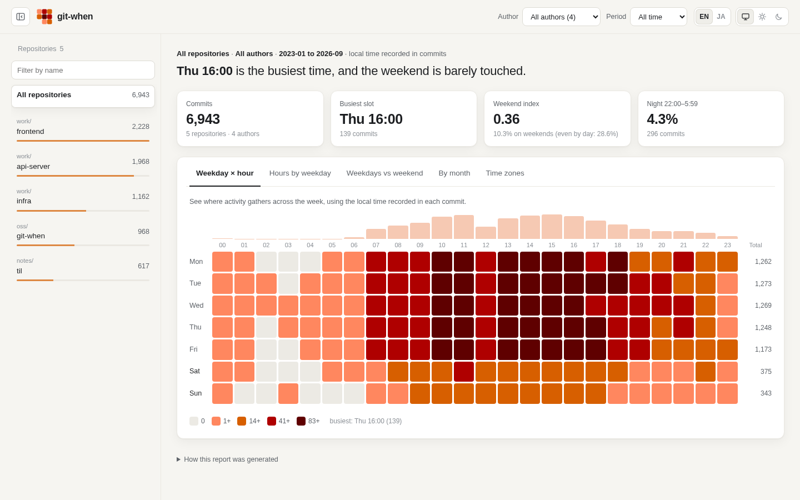

## Errors

Invalid combinations are rejected before any repository is read, and the command exits
with code 2.

```text
$ git-when src --format csv --view week
error: --view, --pivot and --min-total do not apply to --format csv (it writes every bucket)

$ git-when src --format svg --view summary
error: --view: view "summary" is not available in svg (svg: heatmap, hour, week, month, or --pivot)

$ git-when src --view hour --pivot year/hour
error: --view and --pivot cannot be used together (--pivot always draws a grid)

$ git-when src --format html -o svg/
error: --out: svg/ is a directory (only --format svg writes files into a directory)
```

A missing directory or a search that finds no repositories causes the command to exit
with code 1. The absolute path in the first message is shortened here.

```text
$ git-when missing
error: missing: lstat /.../missing: no such file or directory

$ git-when src/work/api-server/.git/objects
error: no git repositories found under src/work/api-server/.git/objects
```
